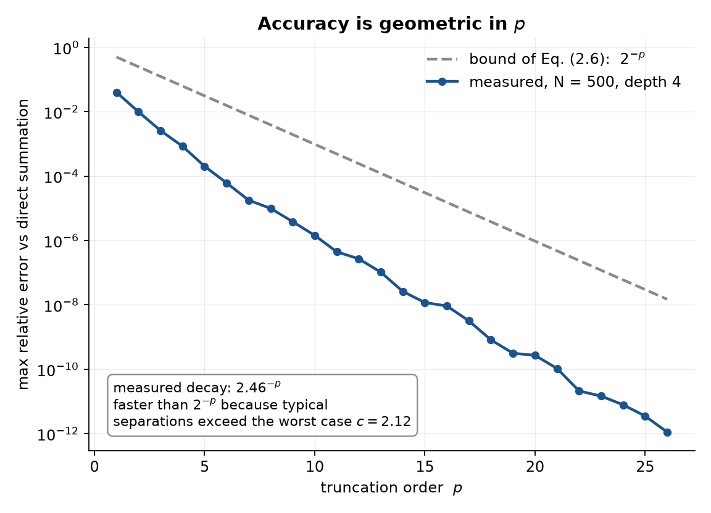
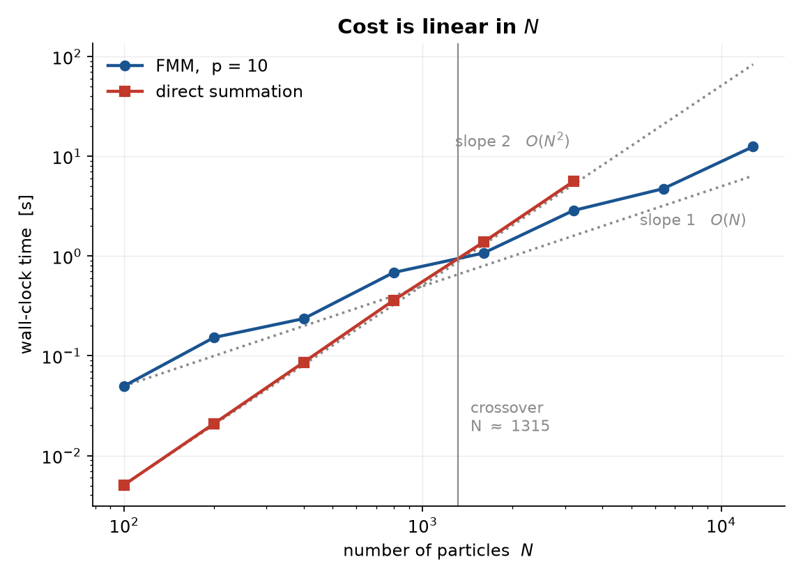

# 2D Fast Multipole Method

A from-scratch Python implementation of the free-space fast multipole method of

> L. Greengard and V. Rokhlin, *A Fast Algorithm for Particle Simulations*,
> Journal of Computational Physics **135**, 280–292 (1997).

Every function cites the theorem, lemma or algorithm step it implements. No
reference implementation was consulted.

---

## The problem

Given `N` charges `q_i` at positions `z_i` in the unit box, compute the potential
at every particle:

```
phi(z_j) = sum_{i != j}  q_i * log(z_j - z_i)
```

In two dimensions the Coulomb potential is `-log r`, and identifying `(x,y)` with
the complex number `z = x + iy` makes the whole calculation complex-analytic.

Evaluated directly this costs `O(N^2)`. The FMM computes it to a prescribed
accuracy `eps` in `O(N)`.

**The idea in one sentence:** a cluster of distant charges is indistinguishable,
to a given precision, from a short list of its multipole moments — so group the
particles in a quadtree, talk to distant groups through `p+1` coefficients
instead of particle by particle, and fall back to direct summation only for the
immediate neighbourhood.

---

## From the paper to the code

| Result in the paper | Function in `fmm.py` |
|---|---|
| Eq. (2.7), definition of `phi` p. 281 | `direct_all` |
| Section 3, mesh hierarchy, p. 285 | `box_center`, `box_index`, `build_tree` |
| Section 2, well-separation, p. 282 | `well_separated` |
| Section 3, interaction list, Fig. 5 | `interaction_list` |
| **Theorem 2.1**, Eq. (2.3) | `p2m`  — particles to multipole |
| **Lemma 2.3** | `m2m`  — multipole to multipole (exact) |
| **Lemma 2.4**, error bound Eq. (2.11) | `m2l`  — multipole to local (**the only approximation**) |
| **Lemma 2.5** | `l2l`  — local to local (exact) |
| Section 3, Step 5, p. 286 | `eval_local` |
| Section 3, Step 6, p. 286 | `direct_sum` |
| Section 3, Steps 1–7, pp. 286–287 | `fmm` |

Three of the four translation operators are exact. All of the method's error
comes from truncating the infinite inner sum of Lemma 2.4.

---

## Running it

```bash
python -m venv .venv
.venv/Scripts/activate          # Windows;  source .venv/bin/activate on Linux/macOS
pip install -r requirements.txt

pytest -q                       # 25 tests
python experiments.py           # regenerates both figures
```

Basic use:

```python
import numpy as np
from fmm import fmm, direct_all

z = np.random.random(1000) + 1j*np.random.random(1000)
q = np.random.normal(size=1000)

potential = fmm(z, q, n=5, p=20).real     # n = tree depth ~ log_4(N),  p ~ -log_2(eps)
```

---

## Results

### Accuracy is geometric in `p`



`N = 500`, tree depth 4, error measured against direct summation.

| `p` | relative error |
|---|---|
| 5 | 2.0e-04 |
| 10 | 1.4e-06 |
| 15 | 1.2e-08 |
| 20 | 2.7e-10 |
| 26 | 1.1e-12 |

The measured decay is `2.46^-p`, consistently *below* the bound `2^-p` of
Eq. (2.6). That bound assumes the worst legal separation `c = 2`; in a real tree
most interacting pairs are further apart, so the observed convergence is faster.
The bound is never violated.

### Cost is linear in `N`



`p = 10`, tree depth `n = round(log_4 N)`.

| `N` | depth | FMM | direct |
|---|---|---|---|
| 100 | 3 | 0.05 s | 0.01 s |
| 400 | 4 | 0.28 s | 0.09 s |
| 800 | 5 | 0.71 s | 0.35 s |
| 1600 | 5 | 1.11 s | 1.43 s |
| 3200 | 6 | 3.01 s | 10.57 s |
| 6400 | 6 | 6.41 s | — |
| 12800 | 7 | 14.41 s | — |

On log axes the slope of each curve is its exponent: direct summation sits on
slope 2, the FMM on slope 1. The two cross near `N ≈ 1300` — below that the
`O(27 p^2)` constant of the FMM is not worth paying, and direct summation is the
better choice. Absolute times are machine-dependent; the slopes are not.

---

## Verification

`test_fmm.py` contains 25 tests in four groups:

- **known values** — coefficients checked against an independently computed
  8-particle hand trace
- **exactness** — `m2m` and `l2l` must reproduce their inputs to machine
  precision (they agree to `1e-20` and `0.0` respectively)
- **physics** — `p2m` → `m2l` → `eval_local` must reproduce `q log(z - z_i)`
- **property** — the measured M2L error is asserted to stay below the bound of
  Eq. (2.11), computed from the paper's own formula

The full algorithm agrees with direct summation to `1.6e-10` relative error on
500 random particles at `p = 20`.

---

## Scope and limitations

- **Free space only.** Sections 1–3 of the paper. The periodic and Dirichlet
  boundary conditions of Section 4 are not implemented.
- **Uniform tree.** The depth is chosen as `log_4 N`, which assumes a roughly
  homogeneous particle distribution. Concentrate all particles into a few
  finest-level boxes and Step 6 degrades towards `O(N^2)`. The fix is the
  adaptive FMM of reference [3] of the paper, which refines only where particles
  are.
- **Potential only.** Forces are available as the analytic derivative of the same
  local expansion (Remark, p. 287) with identical error bounds, but are not
  implemented here.
- **Pure Python/NumPy**, written for clarity over speed. The translation
  operators are scalar loops; a production implementation would vectorise them
  and precompute the binomial coefficients.

---

## Files

```
fmm.py            the algorithm - 13 functions, no module-level code
test_fmm.py       25 tests
experiments.py    the two numerical experiments
figures/          generated by experiments.py
requirements.txt  numpy, matplotlib, pytest
```